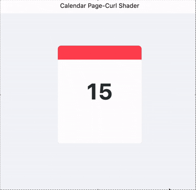

# Flutter Shader Calendar Flip

A beautiful calendar page-curl effect implemented using Flutter and custom fragment shaders.

## Demo

## Features

- Real-time page curl animation.
- Custom GLSL shader for realistic paper physics and shadows.
- Interactives dragging 

## Getting Started

1. Clone the repository.
2. Ensure you have Flutter installed.
3. Run `flutter pub get`.
4. Run the app on a supported platform (macOS, Android, iOS, Web).

## Tech Stack

- **Flutter**: UI Framework.
- **GLSL**: Fragment shaders for complex visual effects.
- **Dart**: Application logic.
